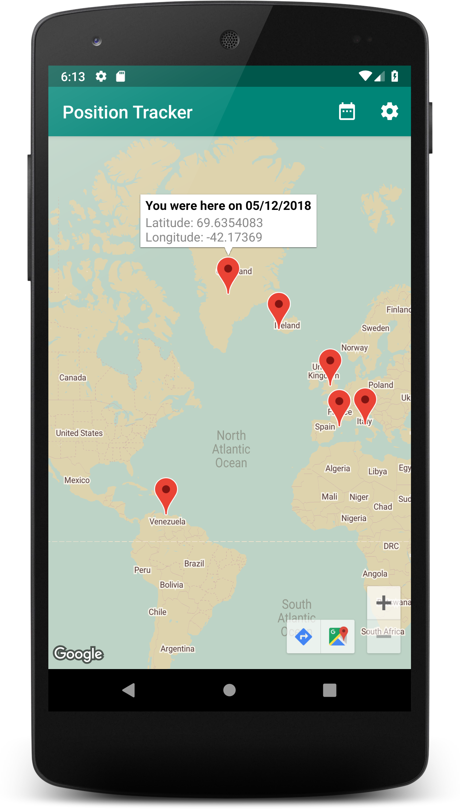

## Android Techdegree Treehouse Project 8: Position Tracker
Many apps, from run trackers to gas mileage calculators, need to track position over time. Create an app that will poll a device for its position over time. Then add a map view with the ability to choose a range of dates and see the positions that were recorded during that time. 

## What Will I Learn?
*   Retrieve the device's last known location using the [Location Services API](https://developer.android.com/training/location/retrieve-current).
*   Shedule deferrable, asynchronous tasks with [WorkManager](https://developer.android.com/topic/libraries/architecture/workmanager).
*   Pesist app data with [Room](https://developer.android.com/topic/libraries/architecture/room).
*   Store and manage UI-related data in a lifecycle conscious way with [LiveData](https://developer.android.com/topic/libraries/architecture/livedata) and [ViewModel](https://developer.android.com/topic/libraries/architecture/viewmodel). 

## Screenshots

